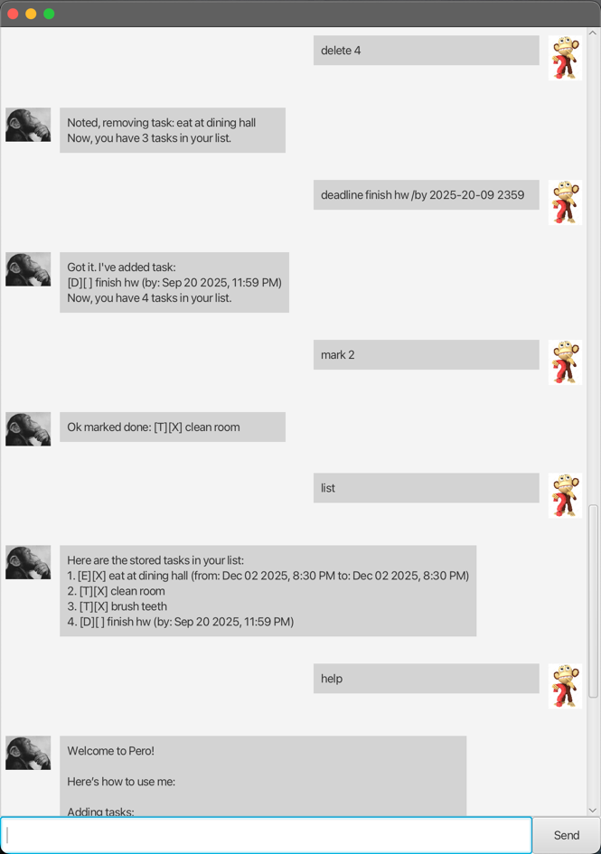

# 📝 Pero

Pero is a simple yet powerful **task management assistant** that runs with GUI support.  
It helps you keep track of your to-dos, deadlines, and events with a friendly interface.

---

## 🚀 Features

- Add different types of tasks: **Todos, Deadlines, Events**
- Mark and unmark tasks as done
- Delete tasks and view task counts
- Search tasks by keyword
- Save tasks to a local file once your done, and reload them when you start!
- GUI support for user-friendly interaction

---

## 🖥️ Preview



---

## ⚙️ Installation

1. Clone the repository:
   ```bash
   git clone https://github.com/your-username/pero.git
   cd pero
